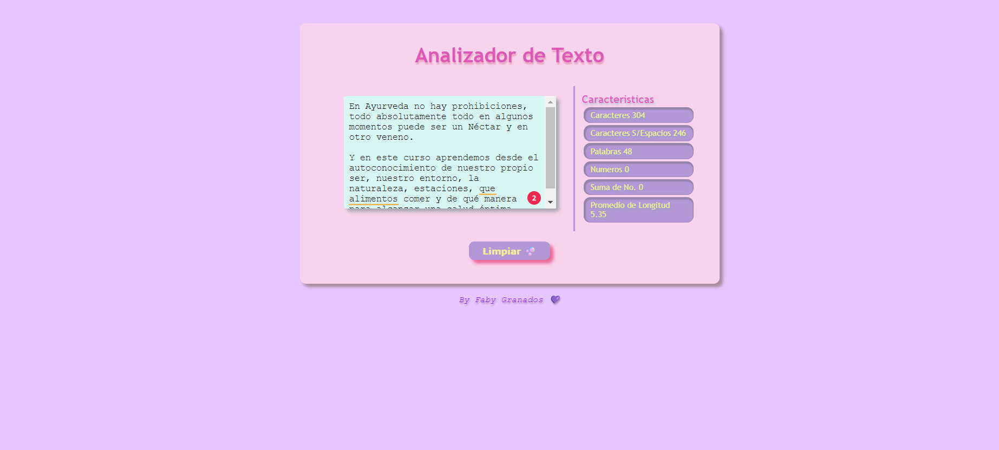

# Text Analyzer
> En este proyecto de un analizador de texto web para calcular y mostrar métricas de un texto enviado por el usuario.
> Live demo [_aqui_](https://fabygranados.github.io/DEV009-text-analyzer/src/).

## Tabla de Contenidos
* [Información general](#informacion-general)
* [Tecnologías utilizadas](#tecnologias-utilizadas)
* [Funcionalidades](#funcionalidades)
* [Screenshots](#screenshots)
* [Boilerplate](#boilerplate)
* [Descripción de scripts / archivos](#descripción-de-scripts--archivos)
* [Instalacion](#instalacion)
* [Criterios de minimos de aceptacion para las pruebas](#criterios-de-aceptación-mínimos-para-las-pruebas)
* [Pruebas](#pruebas)
* [Agradecimientos](#agradecimientos)
* [Contacto](#contacto)


## Información general
  Un analizador de texto es una aplicación para extraer información útil de un texto utilizando diversas técnicas, como el procesamiento del lenguaje natural (NLP), el aprendizaje automático (ML) y el análisis estadístico.
  Estas aplicaciones pueden proporcionar una variedad de métricas que brindan información básica sobre la longitud y la estructura del texto, como por ejemplo, el conteo de palabras, el conteo de caracteres, el conteo de oraciones y el conteo de párrafos. Otras métricas incluyen el análisis de sentimientos, que utiliza técnicas de NLP para determinar el tono general, positivo, negativo o neutral del texto, y el análisis de legibilidad, que utiliza algoritmos para evaluar la complejidad y la legibilidad del texto.


## Tecnologias utilizadas
- HTML
- CSS
- Vanilla JS

## Funcionalidades

La aplicación permite al usuario ingresar un texto escribiéndolo en un cuadro de texto.

La aplicación calcula las siguientes métricas y actualizar el resultado en tiempo real a medida que el usuario escribe su texto:

- Recuento de palabras: la aplicación debe poder contar el número de palabras en el texto de entrada y mostrar este recuento al usuario

- Recuento de caracteres: la aplicación puede contar el número de caracteres en el texto de entrada, incluidos espacios y signos de puntuación, y mostrar este recuento al usuario.

- Recuento de caracteres excluyendo espacios y signos de puntuación: la aplicación puede contar el número de caracteres en el texto de entrada, excluyendo espacios y signos de puntuación, y mostrar este recuento al usuario.

- Recuento de números: la aplicación puede contar cúantos números hay en el texto de entrada y mostrar este recuento al usuario.
- Suma total de números: la aplicación debe sumar todos los números que hay en el texto de entrada y mostrar el resultado al usuario.

 - Longitud media de las palabras: la aplicación puede calcular la longitud media de las palabras en el texto de entrada y mostrársela al usuario.
- La aplicación  permite limpiar el contenido de la caja de texto haciendo clic en un botón.

## Screenshots


## Boilerplate
La lógica del proyecto esta implementada completamente en JavaScript. En este proyecto NO se utilizaron librerías o frameworks, solo JavaScript puro también conocido como Vanilla JavaScript.

El boilerplate contiene esta estructura:

```text
./
├── .babelrc
├── .editorconfig
├── .eslintrc
├── .gitignore
├── README.md
├── package.json
├── src
│   ├── analyzer.js
│   ├── index.html
│   ├── index.js
│   └── style.css
└── test
    ├── .eslintrc
    └── analyzer.spec.js
```

### Descripción de scripts / archivos

* `README.md`: explica la información necesaria para el
  uso de tu aplicación web, así como una introducción a la aplicación, su funcionalidad y decisiones
  de diseño que tomaron.
* `.github/workflows`: esta carpeta contiene la configuracion para la ejecution de Github Actions. 
* `read-only/`: esta carpeta contiene las pruebas de criterios mínimos de
  aceptación y end-to-end.
* [`src/index.html`](./src/index.html): este archivo contiene el HTML principal de este proyecto.
* [`src/style.css`](./src/style.css): este archivo contiene las reglas de
  estilo.
* [`src/analyzer.js`](./src/analyzer.js): acá se implementa el objeto
  `analyzer`, el cual está _exportado_ en el _boilerplate_. Este objeto
  (`analyzer`) contiene seis métodos:
  - `analyzer.getWordCount(text)`: esta función  retorna el recuento de
  palabras que se encuentran en el parámetro `text` de tipo `string`.
  - `analyzer.getCharacterCount(text)`: esta función  retorna el recuento
  de caracteres que se encuentran en el parámetro `text` de tipo `string`.
  - `analyzer.getCharacterCountExcludingSpaces(text)`: esta función  retorna
  el recuento de caracteres excluyendo espacios y signos de puntuación que se
  encuentran en el parámetro `text` de tipo `string`.
  - `analyzer.getNumberCount(text)`: esta función  retorna cúantos números
  se encuentran en el parámetro `text` de tipo `string`.
  - `analyzer.getNumberSum(text)`: esta función retorna la suma de todos
  los números que se encuentran en el parámetro `text` de tipo `string`.
  - `analyzer.getAverageWordLength(text)`: esta función  retorna la longitud
  media de palabras que se encuentran en el parámetro `text` de tipo `string`.

* [`src/index.js`](./src/index.js): aqui se escuchan los eventos del DOM, invocando
  los métodos del objeto `analyzer` según sea necesario y actualizar el resultado
  en la UI (interfaz de usuario).
* [`test/analyzer.spec.js`](./test/analyzer.spec.js): este archivo contiene las
pruebas unitarias para los métodos del objeto `analyzer`.


## Instalacion

Se instalo lo siguiente:

1. [Node.js](https://nodejs.org/)
2. [git](https://git-scm.com/download/) Si estas en Linux es muy probable que
  ya este instalado 👀.
3. se utilizo VSCode

Después en [GitHub](https://github.com/):

1. Crear una cuenta.
2. Realiza un fork de este proyecto
3. Configuracion de SSH Key  en GitHub.

Luego en una shell se ejecuto lo siguiente:

1. Clona el fork en tu PC
2. Ubica la shell en el proyecto que clonaste
3. Instala las dependencias del proyecto con `npm install`
4. Instala `playwright` con `npx playwright install chromium --with-deps`
5. Para arrancar el servidor web `npm start` y dirígete a
   `http://localhost:3000` en tu navegador.


#### Deploy

Hacer que los sitios estén publicados (o _desplegados_) para que usuarias de
la web puedan acceder a él es algo común en proyectos de desarrollo de software.

En este proyecto, utilizaremos _Github Pages_ para desplegar nuestro sitio web.

El comando `npm run deploy` puede ayudarte con esta tarea y también puedes
 consultar su [documentación oficial]

## Criterios de aceptación mínimos para las pruebas

A continuación encontrarás los criterios de aceptación mínimos del proyecto.

### HTML

* **Uso de HTML semántico**

  - La aplicación tiene un encabezado conformado por un
  [`<header>`]que es padre de un
  [`<h1>`] con texto `Analizador de texto`. Estos
  elementos no pueden tener atributos `id`, ni `name`, ni `class`.

  - La aplicación usa un
  [`<textarea>`]
  con un el atributo `name` en el valor `user-input` para permitir al usuario
  ingresar un texto. Este elemento no puede
  tener atributos `id`, ni `class`.

  - La aplicación usa un
  [`<ul>`] con 6 hijos [`<li>`], uno para mostrar cada métrica.  Estos  elementos no pueden tener atributos `id` ni `name`.

  -  La aplicación tiene un pie de página conformado por un  [`<footer>`]
  que es padre de un  [`<p>`]
  que tiene como texto el nombre del desarollador.
  Estos elementos no pueden   tener atributos `id`, ni `name`, ni `class`.

  - La aplicación usa un [`<button>`]
  con el atributo `id` en el valor `reset-button` para permitir al usuario,
  mediante un clic, limpiar el contenido de la caja de texto.

### CSS

* **Uso de selectores de CSS**  

  - La aplicación usa
  [`selectores CSS de tipo`]  para darle estilo al
  [`<header>`]  y al
  [`<footer>`].
  
  - La aplicación usa
  [`selectores CSS de class`]
  para darle estilo al
  [`<ul>`]descrito anteriormente.
  y sus hijos
  [`<li>`].
  
  - La aplicación usa
  [`selectores de atributo`]
  para darle estilo al
  [`<textarea>`]
  usando el atributo `name`.

  - La aplicación usa
  [`selectores CSS de ID`]
  para darle estilo al
  [`<button>`]
  con el atributo `id` en el valor `reset-button`.

* **Modelo de caja (box model): border, margen, padding**

  -Las [`clases css`] de los [`<li>`] hijos del
  [`<ul>`] definen un estilo usando las propiedades del [modelo de caja], [`background`], `border`, [`margin`],  [`padding`].

### Web APIs

* **Uso de selectores del DOM**

  -La aplicación usa el
  [`selector del DOM querySelector`]

  - La aplicación usa el
  [`selector del DOM getElementById`].
  
* **Manejo de eventos del DOM (listeners, propagación, delegación)**

  - La aplicación registra un
  [Event Listener]
  para escuchar el evento `keyup` del `<textarea>` para actualizar las métricas
  cuando se haga escriba en el cuadro de texto.

  -  La aplicación registra un
  [Event Listener]  para escuchar el evento `click` del `<button>` que limpia el contenido de la
  caja de texto.

* **Manipulación dinámica del DOM**
  - La aplicación actualiza el atributo
  [`textContent`]
  o
  [`innerHTML`]
  de los `<li>` que mostrar las métricas del texto.

### JavaScript

* **Tipos de datos primitivos**

  - La aplicación convierte valores tipo `string` a tipo `number`.

* **Strings (cadenas de caracteres)**

  - La aplicación usa métodos para manipular strings como
  [`split`],
  [`trim`]
  o
  [`replace`].

* **Variables (declaración, asignación, ámbito)**

  - La aplicación declara variables con
  [`let`]
  y
  [`const`].

  - La aplicación NO declara variables con  `var`.

* **Uso de condicionales (if-else, switch, operador ternario, lógica booleana)**

  -  La aplicación usa el statement
  [`if..else`]
  para evaluar condiciones.

* **Uso de bucles/ciclos (while, for, for..of)**

  - La aplicación usa el statement
  [`for`]
  para crear un bucle.

* **Funciones (params, args, return)**

  - El objeto `analyzer` contiene un método `getWordCount` para calcular el
  recuento de palabras de un texto.

  - El objeto `analyzer` contiene un método `getCharacterCount` para calcular
  el recuento de caracteres de un texto.

  - El objeto `analyzer` contiene un método `getCharacterCountExcludingSpaces`
  para calcular el recuento de caracteres excluyendo espacios y signos de
  puntuación de un texto.

  - El objeto `analyzer` contiene un método `getNumbersCount` para contar
  cúantos números hay en un texto.

  - El objeto `analyzer` contiene un método `getNumbersSum` para la suma
  longitud media de los números en un texto.

  - El objeto `analyzer` contiene un método `getAverageWordLength` para
  calcular la longitud media de las palabras en un texto.

* **Módulos de ECMAScript (ES Modules)**

  - La aplicación usan
  [`import`]
  y
  [`export`]
  para importar y exportar valores desde un modulo JavaScript.

* **Uso de linter (ESLINT)**

  - Al ejecutar el linter no se muestran errores de formato y estilo.

* **Uso de identificadores descriptivos (Nomenclatura y Semántica)**

  - En el código se utilizan identificadores descriptivos para variables
  y funciones.


## Pruebas

Este proyecto cuenta con 3 conjuntos de pruebas que te ayudarán a conocer si
cumples los criterios mínimos de aceptación.

### Pruebas unitarias

Una prueba unitaria es una técnica de prueba de software en la que se comprueba
que cada componente individual de un programa o sistema funciona correctamente
de manera aislada. En otras palabras, se prueba cada unidad de código por
separado para asegurarse de que cumpla con los requisitos y especificaciones.

Las pruebas unitarias de este proyecto ejecutarán los métodos `getWordCount`,
`getCharacterCount`, `getCharacterCountExcludingSpaces`, `getNumbersCount`,
`getNumbersSum` y `getAverageWordLength` con diferentes argumentos y se
confirmará que los valores retornados sean los esperados.

Puedes ejecutar estas pruebas con el comando `npm run test` 

El _boilerplate_ incluye tareas que ejecutan [eslint] y
[htmlhint] para verificar el `HTML` y
`JavaScript` con respecto a una guías de estilos. Ambas tareas se ejecutan
automáticamente antes de ejecutar las pruebas unitarias cuando usamos el comando
`npm run test`. En el caso de `JavaScript` estamos usando un archivo de
configuración de `eslint` que se llama `.eslintrc` que contiene un mínimo de
información sobre el parser que usar (qué version de JavaScript/ECMAScript), el
entorno (browser en este caso) y
las reglas recomendadas (`eslint:recommended`).
En cuanto a reglas/guías de estilo en sí,
usaremos las recomendaciones _por defecto_ de tanto `eslint` como `htmlhint`.

### Pruebas de criterios mínimos de aceptación

Estas pruebas analizan los archivos
[`index.html`](src/index.html),
[`index.js`](src/index.html),
[`analyzer.js`](src/analyzer.js)
y
[`style.css`](src/style.css)
para verificar que cumple con los
[criterios minimos de aceptacion](#criterios-de-aceptación-mínimos-para-las-pruebas).

Puedes ejecutar todas estas pruebas con el comando `npm run test:oas`

Puedes ejecutar las pruebas de cada grupo de
manera individual con los siguientes comandos:

* `npm run test:oas-html`
* `npm run test:oas-css`
* `npm run test:oas-web-api`
* `npm run test:oas-js`

#### Pruebas end-to-end

Una prueba end-to-end (E2E) es una técnica de prueba de software en la que
se verifica el funcionamiento de todo el sistema desde el inicio hasta el
final. En otras palabras, se prueba el flujo completo del software, simulando
la interacción del usuario con la aplicación, para asegurarse de que todas las
partes del sistema funcionan correctamente en conjunto.

Puedes ejecutar estas pruebas con el comando `npm run test:e2e`

### Github actions

Este repositorio usa una GitHub Action para ejecutar automáticamente
las pruebas unitarias, pruebas de criterios mínimos de aceptación y
y pruebas end-to-end cada vez que se hagas un _push_ en la rama
_main_ de tu repositorio.

Puedes consultar el resultado de esta Github Action
en la pestaña _Actions_ de tu repositorio en Github.


## Agradecimientos
Este proyecto fue diseñado por Laboratoria como primer proyecto del Bootcamp de desarrollo software DEV009.
- Quiero agradecer a Laboratoria por la oportunidad de estar en este espacio.
- Agradezco a mi familia por el apoyo en este camino y a los coach que estan siempre dispuestos a ayudar.
- Agradezco a una compañera, estuvimos acompañandonos en todo el proceso.


## Contacto
Created by [Faby Granados](https://github.com/Fabygranados) - Opensourced in [Github](https://github.com/Fabygranados/DEV009-text-analyzer).


